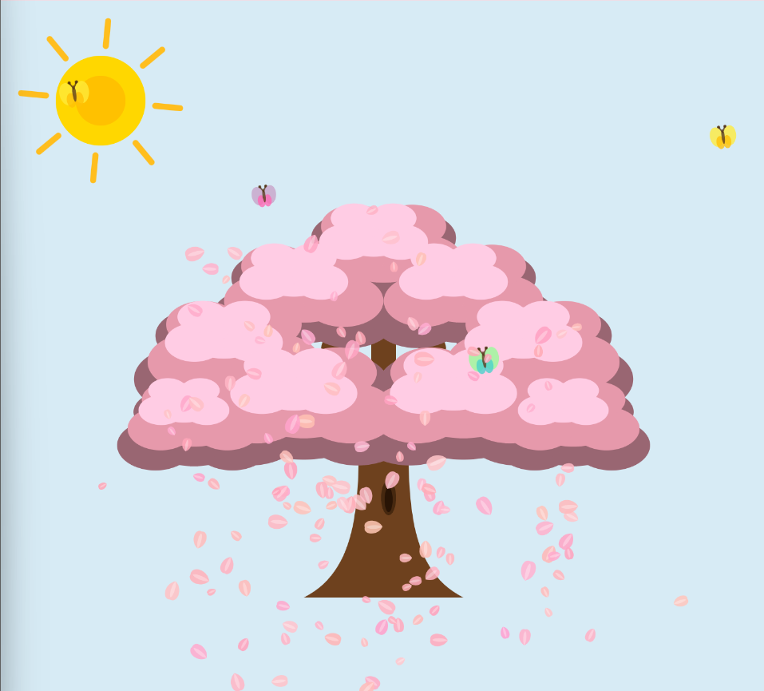

# p5js-season-tree
A generative four-season animation created with p5.js.
#  Season Tree

A generative four-season animation created with **p5.js**.

「四季之樹」是互動媒體課程中製作的生成式視覺作品。
作品會隨著時間自動呈現春、夏、秋、冬的季節變化，
透過樹木色彩、粒子效果與動物動畫，營造不同季節的視覺氛圍。

 **Live Demo:**  
https://dorishsuan0719.github.io/p5js-season-tree/

---

##  Preview

---

##  Features

- Automatic spring, summer, autumn and winter transitions
- Smooth color transitions using `lerpColor()`
- Seasonal particle effects such as cherry blossoms, leaves and snowflakes
- Perlin Noise for natural movement
- Object-oriented animation using JavaScript classes
- Randomized season sequence after the first cycle
- Off-screen rendering with `createGraphics()`
- Responsive full-screen canvas

---

##  Technologies

- JavaScript
- p5.js
- HTML
- CSS

---

##  Technical Highlights

### Smooth Seasonal Transition

Instead of changing colors instantly, `lerpColor()` is used to gradually blend the background and tree colors between seasons.

### Particle System

Different particle effects are generated according to the current season, including cherry blossoms, autumn leaves and snowflakes.

### Perlin Noise Movement

`noise()` is used to create smoother and more natural movement for animated elements such as butterflies.

### Object-Oriented Design

Animation elements such as particles, butterflies, fireflies and birds are organized using JavaScript classes.

### Off-screen Rendering

Snowflake graphics are pre-rendered using `createGraphics()` and reused during animation to reduce repeated drawing operations.

---

##  My Contribution

This project was developed as a team project for an Interactive Media course.

I was mainly responsible for the **non-interactive generative artwork**, including the four-season visual presentation and related development.

---

##  Team Project

Interactive Media Course Project  
Developed by YuHsuan Chen and team.
